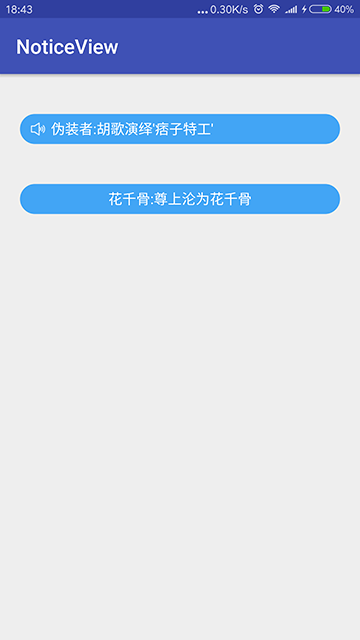

# NoticeView
 
[](https://jitpack.io/#czy1121/noticeview)
 
滚动播放的公告控件  



## Gradle

``` groovy
repositories { 
    maven { url "https://jitpack.io" }
}
```  
    
``` groovy
dependencies {
    compile 'com.github.czy1121:noticeview:1.0.0'
}
```
    
## Usage
    
**XML**

``` xml 
<com.github.czy1121.view.NoticeView
    android:id="@+id/notice"
    android:layout_width="match_parent"
    android:layout_height="30dp"
    android:layout_margin="20dp"
    android:background="@drawable/bg_round"
    android:paddingLeft="10dp"
    android:paddingRight="10dp" 

    app:nvIcon="@mipmap/notice"
    app:nvIconPadding="5dp"
    app:nvIconTint="@android:color/white"
    app:nvTextColor="#FFFFFFFF"
    app:nvTextGravity="left"
    app:nvTextSize="14sp"
    />

<com.github.czy1121.view.NoticeView
    android:id="@+id/notice2"
    android:layout_width="match_parent"
    android:layout_height="30dp"
    android:layout_margin="20dp"
    android:background="@drawable/bg_round"
    android:paddingLeft="10dp"
    android:paddingRight="10dp" 

    app:nvInterval="2000"
    app:nvTextColor="#FFFFFFFF"
    app:nvTextGravity="center"
    />
``` 

**Java**

``` 
vNotice = (NoticeView) findViewById(R.id.notice);
vNotice.start(Arrays.asList(notices));
vNotice.setOnClickListener(new View.OnClickListener() {
    @Override
    public void onClick(View v) {
        Toast.makeText(MainActivity.this, notices[vNotice.getIndex()], Toast.LENGTH_SHORT).show();
    }
});
```

**属性**

``` xml  
<declare-styleable name="NoticeView">
    <!-- 图标 -->
    <attr name="nvIcon" format="reference"/>
    <!-- 图标与内容的间隙 -->
    <attr name="nvIconPadding" format="dimension"/>
    <!-- 图标颜色 -->
    <attr name="nvIconTint" format="color"/>

    <!-- 文本尺寸 -->
    <attr name="nvTextSize" format="dimension"/>
    <!-- 文本颜色 -->
    <attr name="nvTextColor" format="color"/>
    <!-- 文本最大行数 -->
    <attr name="nvTextMaxLines" format="integer"/>
    <!-- 文本对齐方式 -->
    <attr name="nvTextGravity" format="integer">
        <enum name="left" value="3"/>
        <enum name="center" value="17"/>
        <enum name="right" value="5"/>
    </attr>

    <!-- 切换动画间隔时间，毫秒 -->
    <attr name="nvInterval" format="integer"/>
    <!-- 切换动画持续时间，毫秒 -->
    <attr name="nvDuration" format="integer"/>
</declare-styleable>
```
 

## License

```
Copyright 2016 czy1121

Licensed under the Apache License, Version 2.0 (the "License");
you may not use this file except in compliance with the License.
You may obtain a copy of the License at

   http://www.apache.org/licenses/LICENSE-2.0

Unless required by applicable law or agreed to in writing, software
distributed under the License is distributed on an "AS IS" BASIS,
WITHOUT WARRANTIES OR CONDITIONS OF ANY KIND, either express or implied.
See the License for the specific language governing permissions and
limitations under the License.
```